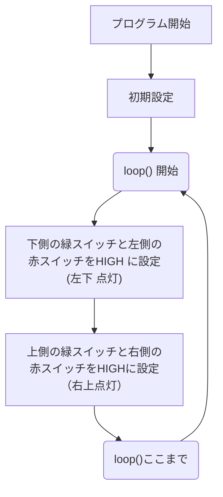

# ミニ電光掲示板プログラミング体験
## 2025年6月28日

## 宇部高専 制御情報工学科
教員：江原 史郎・田辺 誠
学生（4年生）

 

---
layout: two-cols-header
---

## 電光掲示板のしくみ？

::left::


::right::

- 748,800個のLEDから構成される。
- 映像ソースを制御するコンピュータと**映像を写すコンピュータ**から構成される。
- **ミニ電光掲示板体験！**

---
layout: two-cols-header
---

## Matrix LED（行列型のLED）の点け方

::left::


::right::

1. 緑ボタン(行）と赤ボタン（列）を押す。
2. 緑から赤に電流が流れ、交点のLEDが点灯する。

---
layout: two-cols-header
---

## やってみよう！

::left::
### 左下の4x4のLEDだけを光らせよう！


::right::
### 右上の4x4のLEDだけを光らせよう！


---
layout: two-cols-header
---
## やってみよう！
### 左上と右下を同時に光らせよう！

::left::


::right::


---

## むちゃ手が疲れる！

＜学生が操作している動画＞


---
layout: two-cols-header
---

## プログラムの出番

::left::
1. 回路とコンピュータを導線で接続する。
2. プログラムを使って、コンピュータから接続先に「HIGH」「LOW」の電圧を設定する。
3. 手で押したのと同じ効果が得られる。

::right::



---
layout: two-cols-header
---

## やってみよう！

::left::


::right::
1. `▶シミュレーション開始`をクリックする。
2. 左側のMatrix LEDの変化を見る。
3. 右側のloop()の中を確認する。ただし、58行目と72行目は実行されない（/*と*/で囲んであるから）

---
layout: two-cols-header
---

## やってみよう！

::left::

58行目の
```
  	/* 
```
と
72行目の
```
  	*/ 
```
を削除して実行してみよう。

::right::


---

## わかったこと
1. コンピュータを使って、人の手では手間のかかる**機械の制御**を行うことができる。
2. コンピュータが行う作業を書いたものを**プログラム**とよぶ。
3. 制御情報工学科では「**機械の制御ができる情報技術者**」を育成する！

---

## 家でもできます！
https://www.tinkercad.com/things/4novUPWfF1w-?sharecode=Onf_GE3mlEn0Sq_Zi_aWAtnwpw8Z4ybddtX33gzPmZc


---

## ブースのご案内
- ラジコンカー（スマホの傾きセンサーとラジコン内のマイコンをBluetooth通信：制御学生の作品）
- ミニ掲示板（体験内容の実機デモ）
-


