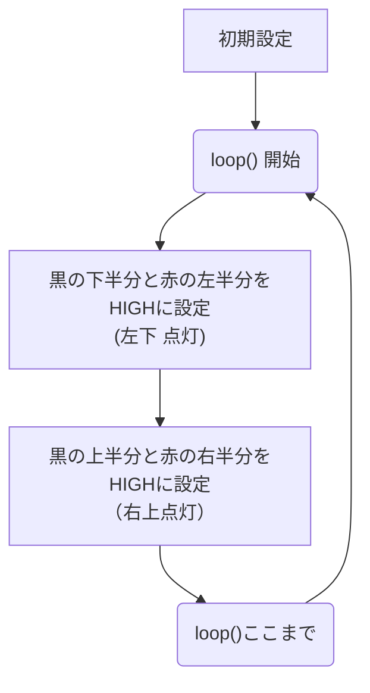
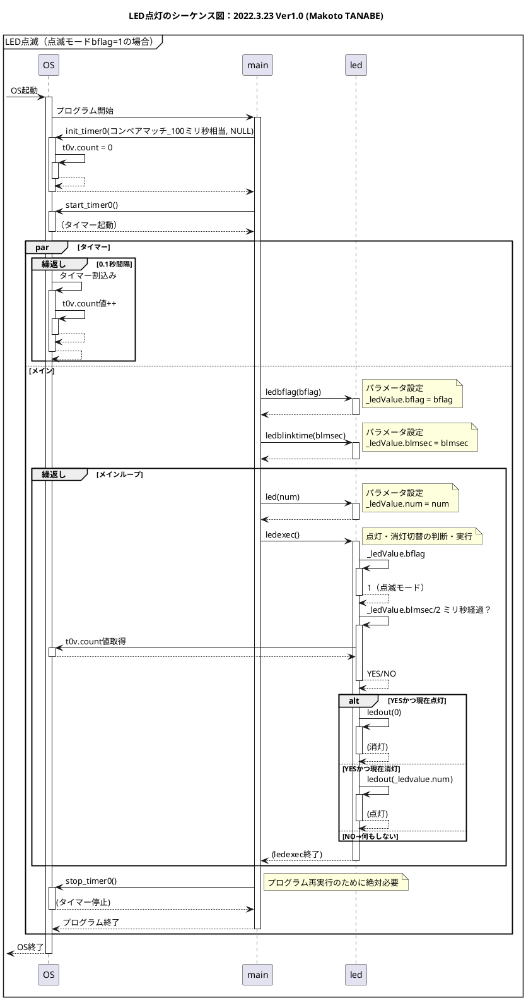

# ミニ電光掲示板プログラミング体験
## 2025年6月28日

## 宇部高専 制御情報工学科
教員：江原 史郎・田辺 誠  
学生（4年生）


---

## じつは <span v-click>**→コンピュータとプログラムが活躍！**</span><span v-click>（8x8のLEDで体験）</span>


---
layout: two-cols-header
---

## 8x8のLED（Matrix LEDとよびます）のしくみ

::left::


::right::

## 1. <span v-click>黒ボタン(行）と赤ボタン（列）を押す。</span>
## 2. <span v-click>黒に5V、赤に0Vの電圧がかかるため、交点のLEDが点灯する。</span>

---
layout: two-cols-header
---

## やってみよう！

::left::
### 演習1: 左下の4x4のLEDを光らせよう！


::right::
### 演習2: 右上の4x4のLEDを光らせよう！


---
layout: two-cols-header
---

## やってみよう！

::left::
### 解答1: 左下の4x4のLEDを光らせよう！


::right::
### 解答2: 右上の4x4のLEDを光らせよう！


---

## やってみよう！

## 問題3: 左下と右上を光らせよう！


---

## やってみよう！

## 解答3: 
 


---
layout: two-cols
---

 

::right::
# <span v-click> <br/>コンピュータに<br/><br/>　　まかせてしまえ<br/><br/>　　　　**ダイナミック点灯**<br/><br/></span>

---
layout: two-cols
---

 

1. スイッチの代わりにコンピュータを回路に接続する。
2. プログラムを使って、コンピュータから回路先にHIGH（押す）LOW（離す）を設定する。**すごい勢いで**（ここ大事）
- 「黒の下半分だけHIGH」「赤の左半分だけHIGH」
- 「黒の上半分だけHIGH」「赤の右半分だけHIGH」
3. 手で無茶苦茶早く押すのと同じ効果！<br/>（**ダイナミック点灯**）

::right::


## プログラムの設計図（フローチャート）

---

## シミュレーションしよう！

 

1. `▶シミュレーション開始`をクリックして開始する。
2. Matrix LEDの変化を見る。
3. プログラム内の`loop()`を確認する。ただし、58行目～72行目（`/*`と`*/`の間）は実行されない
4. `シミュレーションを停止`をクリックして停止する。

---

## ダイナミック点灯しよう！
58行目の`/*`と72行目の`*/`を削除して`▶シミュレーション開始`しよう。

 

---
layout: two-cols-header
---

## ダイナミック点灯しよう！

::left::
 

::right::

 

---

## わかったこと
1. コンピュータを使って、**機械の制御**を安全かつ正確に行うことができる。
2. コンピュータへの指示を**プログラム**で行う。
3. 制御情報工学科では「**機械の制御ができる情報技術者**」を育成する！
4. 設計開発のV字プロセス（設計・実装・検証）を教えます。

---
layout: two-cols-header
---

## プログラミング（実装）

::left::
 
<div style="height: 200px;"></div>

::right::


```c
void motor_fwd(void)
{
	static motorcp pmc=NULL;
	if (pmc==NULL) pmc=mc();
  if (pmc->cnt!=0x18) { // 同じ場合は実行しない。
		pmc->mflag = (pmc->mflag&~3)|1;
		pmc->cnt = 0x18 ;
		PADR=pmc->cnt;
	}
	return;
}
```

---
layout: two-cols-header
---

## 設計

::left::
 
<div style="height: 200px;"></div>
::right::




---
layout: two-cols-header
---

## テスト（検証）

::left::
 
<div style="height: 200px;"></div>
::right::

 


---

## 家でもできます！
https://www.tinkercad.com/things/4novUPWfF1w-?sharecode=Onf_GE3mlEn0Sq_Zi_aWAtnwpw8Z4ybddtX33gzPmZc


