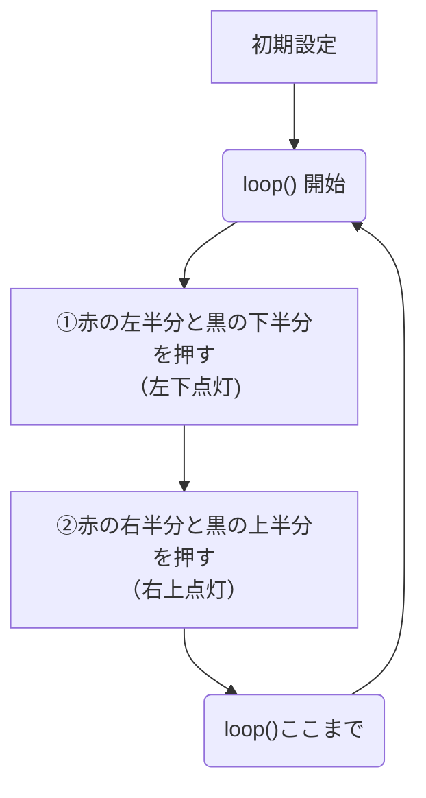
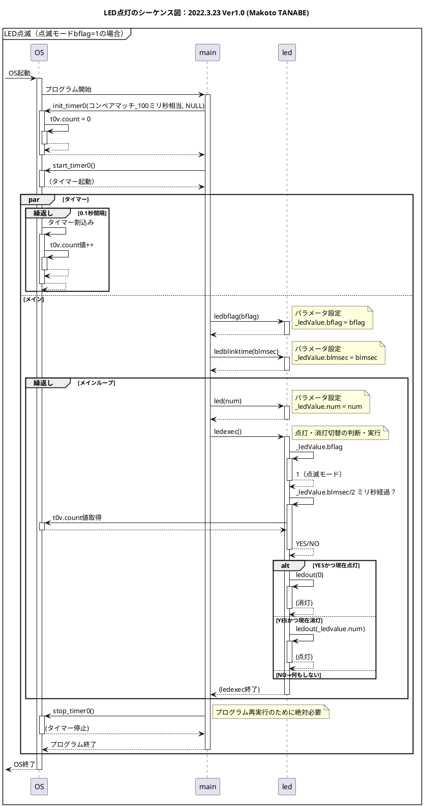

# ミニ電光掲示板プログラミング体験
## 2025年6月28日

## 宇部高専 制御情報工学科
教員：江原 史郎・田辺 誠  
学生（4年生）


---

## 資料

- [今回の実習資料](https://github.com/cslab-nituc/ise-taiken2025)


- [仮想実習環境（Tinkercad）](https://www.tinkercad.com/joinclass/76STCHZQY)
- [Arduino Reference Manual](https://docs.arduino.cc/language-reference/)

<!--

-->
<div style="height: 200px;"></div>

---

## じつは <span v-click>**→コンピュータとプログラムが活躍！**</span><span v-click>（8x8のLEDで体験）</span>


写真は(株)広島東洋カープ提供  
技術情報はパナソニックシステムネットワークス（株）提供

---
layout: two-cols-header
---

## 8x8のLED（Matrix LEDとよびます）のしくみ

::left::


::right::

## 1. <span v-click>赤ボタンと黒ボタンを押す。</span>
## 2. <span v-click>赤がプラス（5V）<br/>　黒がマイナス（0V）<br/>　に接続され、<br/>　交点のLEDが点灯する。</span>

---
layout: two-cols-header
---

## やってみよう！

::left::
### 演習1: 左下の4x4のLEDを光らせよう！


::right::
### 演習2: 右上の4x4のLEDを光らせよう！


---
layout: two-cols-header
---

## やってみよう！

::left::
### 解答1: 左下の4x4のLEDを光らせよう！


::right::
### 解答2: 右上の4x4のLEDを光らせよう！


---

## やってみよう！

## 演習3: 左下と右上を光らせよう！


---

## やってみよう！

## 解答3: 
 
<div style="height: 200px;"></div>


---
layout: two-cols
---

 

::right::
# <span v-click> <br/>コンピュータに<br/><br/>　　まかせてしまえ<br/><br/>　　　　**ダイナミック点灯**<br/><br/></span>

---
layout: two-cols
---

 

1. スイッチの代わりにコンピュータを回路に接続する。
2. 「**すごい勢いで**①②を繰り返す」プログラムを作成する。  
① 「赤の左半分だけ押す」「黒の下半分だけ押す」  
② 「赤の右半分だけ押す」「黒の上半分だけ押す」  
3. プログラムをコンピュータで実行する  
→手で無茶苦茶早く押すのと同じ効果！<br/>（**ダイナミック点灯**）

::right::


## プログラムの設計図（フローチャート）

---

## 演習4: シミュレーションしよう！

 

1. `▶シミュレーション開始`をクリックして開始する。
2. Matrix LEDの変化を見る。
3. プログラム内の`loop()`を確認する。ただし、57行目～71行目（`/*`と`*/`の間）は実行されない
4. `シミュレーションを停止`をクリックして停止する。

---
layout: two-cols
---

## 演習5: ダイナミック点灯しよう！
57行目の`/*`と71行目の`*/`を削除して
### `▶シミュレーション開始`
しよう。

::right::
 

---
layout: two-cols-header
---

## 演習5: ダイナミック点灯しよう！

::left::
 

::right::

 

---

## まとめ：わかったこと
1. コンピュータを使って、**機械の制御**を安全かつ正確に行うことができる。
2. コンピュータへの指示を**プログラム**で行う。
3. 制御情報工学科では「**機械の制御ができる情報技術者**」を育成する！
4. 設計開発のV字プロセス（設計・実装・検証）を教えます。

---
layout: two-cols-header
---

## プログラミング（実装）

::left::
 
<div style="height: 200px;"></div>

::right::


```c
void motor_fwd(void)
{
	static motorcp pmc=NULL;
	if (pmc==NULL) pmc=mc();
  if (pmc->cnt!=0x18) { // 同じ場合は実行しない。
		pmc->mflag = (pmc->mflag&~3)|1;
		pmc->cnt = 0x18 ;
		PADR=pmc->cnt;
	}
	return;
}
```

---
layout: two-cols-header
---

## 設計

::left::
 
<div style="height: 200px;"></div>
::right::




---
layout: two-cols-header
---

## テスト（検証）

::left::
 
<div style="height: 200px;"></div>
::right::

 


---

## 自宅でもできます！

- [今回の実習資料](https://github.com/cslab-nituc/ise-taiken2025)


- [シミュレータ（Tinkercad）](https://www.tinkercad.com/things/4novUPWfF1w-?sharecode=Onf_GE3mlEn0Sq_Zi_aWAtnwpw8Z4ybddtX33gzPmZc)
- [Arduino Reference Manual](https://docs.arduino.cc/language-reference/)

<!--

-->
<div style="height: 200px;"></div>